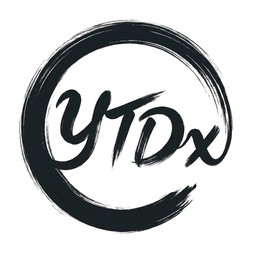
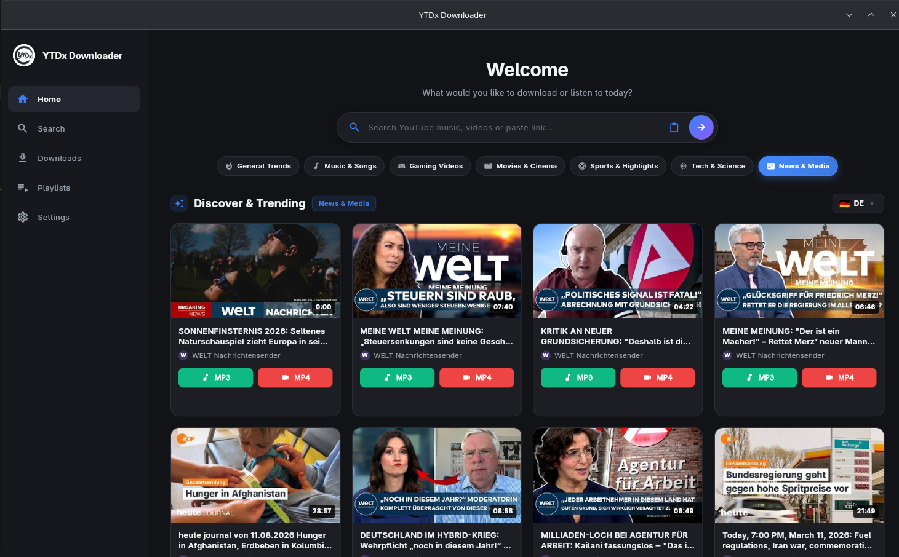
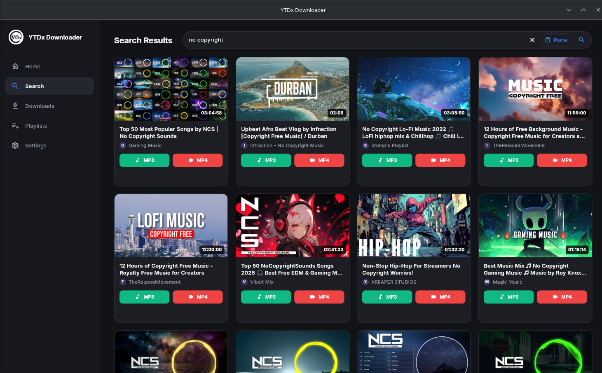
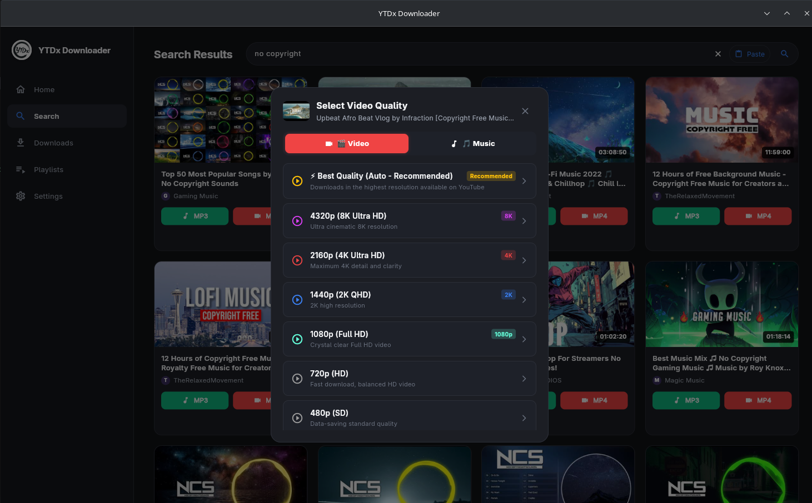
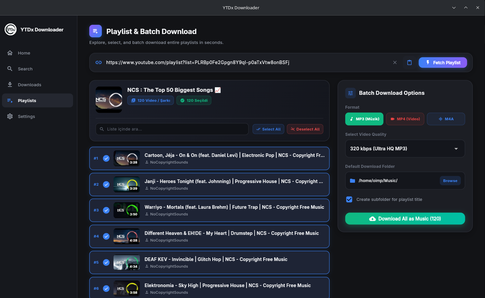
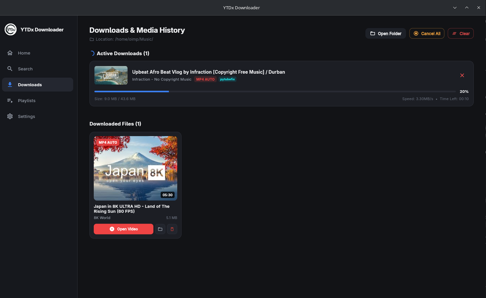
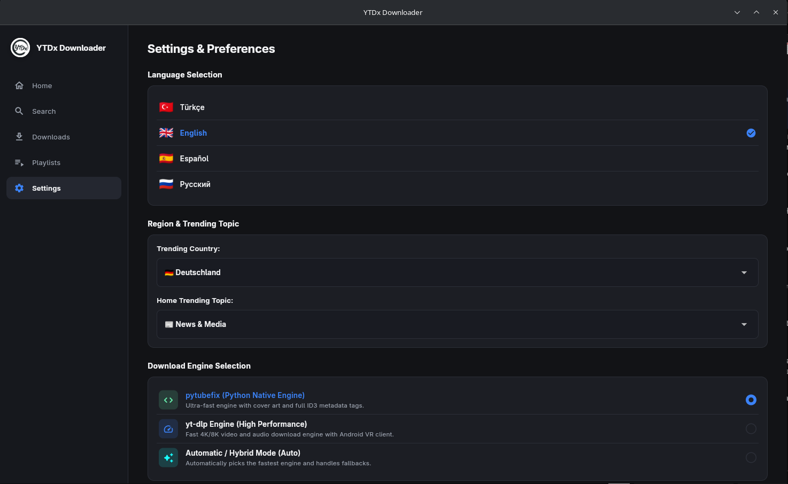

<div align="center">

  

  # ⚡ YTDx Studio
  ### Next-Generation 4K Video & 320kbps Music Downloader Desktop Suite

  [](https://flutter.dev)
  [](https://python.org)
  [](https://github.com/AllLiveSupport/YTDx-Studio)
  [](LICENSE)
  [](#performance)

  <p align="center">
    <b>YTDx Studio</b> is a high-performance, modern, and beautiful desktop application designed for seamless YouTube video and audio downloading, playlist batch management, in-app media playback, and live global trend exploration.
  </p>

  [Key Features](#-key-features) • [Screenshots](#-screenshots-showcase) • [Quick Installation](#-quick-1-step-installation) • [Architecture](#-architecture) • [Contributing](#-contributing)

</div>

---

## 🌟 Key Features

### 🎬 1. Ultra HD 4K/8K Video Downloader
- Download videos in **4320p (8K)**, **2160p (4K)**, **1440p (2K)**, **1080p (Full HD)**, **720p**, and **480p**.
- Automatic **FFmpeg DASH Adaptive Muxing**: Combines master video streams with high-bitrate audio streams in 0.3s with zero quality degradation.

### 🎵 2. Studio Master 320kbps MP3 & ID3 Cover Embedding
- Extract crystal-clear **320kbps MP3**, **256kbps M4A (AAC)**, **FLAC (Lossless Hi-Res)**, and **WAV** audio.
- Automatic **ID3v2 Metadata & HD Album Art Embedding** directly into audio files for full compatibility with Spotify, Apple Music, VLC, and car stereos.

### 📑 3. Spotify/Apple Music Style Playlist Batch Engine
- Parse entire YouTube playlists in seconds.
- **In-Playlist Real-Time Search**: Instantly filter tracks inside 100+ item playlists.
- Quick Selection Pills: *Select All*, *Deselect All*, *Invert Selection*.
- Batch Download Control Center with custom subfolder auto-organization.

### 🌍 4. Multi-Country & Multi-Topic Trending Explorer
- Real-time localized trend exploration across **7 Topic Categories**: *General Trends*, *Music & Songs*, *Gaming*, *Movies & Cinema*, *Sports*, *Tech & Science*, *News & Media*.
- Native language trend algorithms for **South Korea (K-Pop)**, **Japan (J-Pop/Anime)**, **United States**, **Germany**, **France**, **Spain**, **Brazil**, **Russia**, **Azerbaijan**, and **Turkey**.

### 🎧 5. Integrated In-App Media Player
- Persistent bottom player bar with seek slider, track artwork, volume control, and playback controls.
- Play downloaded MP3s and MP4s immediately inside the app without needing external players.

### ⚡ 6. 120 FPS High-Performance Engine
- Built with **Flutter Desktop AOT Native Machine Code**.
- **0ms Instant In-Memory Query Caching** for instant category and search navigation.
- Isolated **GPU RepaintBoundaries** for zero frame drops during active downloads.

---

## 📸 Screenshots Showcase

<div align="center">

### 🏠 Home & Instant Category Switcher


<br><br>

### 🔍 Fast Search & Media Discovery


<br><br>

### 💎 Format & Studio Quality Modal


<br><br>

### 📑 Modern Playlist & Batch Downloader


<br><br>

### 📥 Active Downloads & History Management


<br><br>

### ⚙️ Engine, Theme & Localization Settings


</div>

---

## 📦 Download & Quick Installation (Pre-Built Binaries)

Choose the best package for your Linux distribution from [GitHub Releases](https://github.com/AllLiveSupport/YTDx-Studio/releases/tag/v1.0.0):

### 🚀 1. Universal `.AppImage` (Recommended - Works on All Linux)
No installation required. Double-click or run from terminal:
```bash
# Make executable and run
chmod +x YTDx-Studio-1.0.0-x86_64.AppImage
./YTDx-Studio-1.0.0-x86_64.AppImage
```

### 🐧 2. Debian / Ubuntu / Linux Mint / Pop!_OS (`.deb`)
```bash
sudo dpkg -i ytdx-studio_1.0.0_amd64.deb
sudo apt-get install -f  # (optional) resolves any missing system libraries
```

### 📦 3. Portable `.tar.gz` (Complete Bundle with 1-Click Installer)
Extract anywhere and run the automated desktop installer:
```bash
# 1. Extract archive
tar -xzf YTDx-Studio-1.0.0-Linux-x86_64.tar.gz

# 2. Enter folder
cd YTDx-Studio-1.0.0

# 3. Run automated installer (creates desktop icon and app menu entry)
chmod +x install.sh
./install.sh
```

### 🏹 4. Arch Linux / Manjaro / CachyOS (`PKGBUILD`)
```bash
makepkg -si
```

---

## 🧹 Complete Uninstallation
To cleanly remove all desktop shortcuts, application menu entries, and binary symlinks from your system:
```bash
./uninstall.sh
```

---

## 🛠️ Clone & Install from Source (For Developers)

You can also clone the repository and run the automated universal setup:

```bash
# 1. Clone the repository
git clone https://github.com/AllLiveSupport/YTDx-Studio.git
cd YTDx-Studio

# 2. Run the automated installer
chmod +x install.sh
./install.sh
```

### What `install.sh` does automatically:
1. 🔍 Detects your Linux distribution (`pacman`, `apt`, `dnf`, `zypper`).
2. 📦 Installs **FFmpeg**, **Python 3**, and media libraries (`libgtk-3`, `libgstreamer`).
3. 🐍 Sets up an isolated `.venv` environment and installs dependencies (`pytubefix`, `yt-dlp`, `mutagen`, `Pillow`).
4. 🖥️ Integrates **YTDx Studio** into your **Linux Application Menu** with desktop shortcut & high-resolution icon.
5. ⚡ Adds the `ytdx` command to your terminal.

---

## 🛠️ Manual Build & Development

If you are a developer and want to build the Flutter release binary manually:

### Prerequisites:
- [Flutter SDK (3.x+)](https://docs.flutter.dev/get-started/install/linux)
- [Python (3.10+)](https://www.python.org/)
- [FFmpeg](https://ffmpeg.org/)

### Build Commands:
```bash
# 1. Install Python dependencies
python3 -m venv .venv
.venv/bin/pip install -r requirements.txt

# 2. Build Flutter Linux Release Bundle
cd aura_app
flutter pub get
flutter build linux --release
cd ..

# 3. Run Application
python3 main.py
```

---

## 🏗️ Architecture

```
YTDx-Studio/
├── aura_app/                  # Flutter 3.x Desktop Client (AOT Compiled)
│   ├── lib/
│   │   ├── models/            # VideoItem, DownloadTask, AppSettings
│   │   ├── providers/         # AppState, PlayerProvider
│   │   ├── screens/           # Home, Search, Downloads, Playlists, Settings
│   │   ├── services/          # Pure Dart YouTube Engine, OAuth 2.0, I18n, Audio
│   │   ├── theme/             # Modern Dark / Light Design Tokens
│   │   └── widgets/           # VideoCard, QualityModal, Sidebar, PlayerBar
│   └── linux/                 # Native Linux GTK Runner
├── src/
│   ├── pytube_runner.py       # High-speed Pytubefix 4K/320k FFmpeg remux CLI
│   └── oauth_helper.py        # OAuth helper bridge
├── docs/images/               # UI Showcase Screenshots
├── icons/                     # Application Icons (256x256, 128x128, ICO, PNG)
├── install.sh                 # Multi-Distro Automated Linux Setup Script
├── main.py                    # Universal Release Launcher & Bridge
└── requirements.txt           # Python backend dependencies
```

---

## 🌐 Supported Languages

YTDx Studio features 100% native localization:
- 🇹🇷 **Türkçe** (Turkish)
- 🇺🇸 **English** (English)
- 🇪🇸 **Español** (Spanish)
- 🇷🇺 **Русский** (Russian)

---

## 🤝 Contributing

Contributions, issues, and feature requests are welcome! Feel free to check the [issues page](https://github.com/AllLiveSupport/YTDx-Studio/issues).

1. Fork the Project
2. Create your Feature Branch (`git checkout -b feature/AmazingFeature`)
3. Commit your Changes (`git commit -m 'Add some AmazingFeature'`)
4. Push to the Branch (`git push origin feature/AmazingFeature`)
5. Open a Pull Request

---

## ⚖️ Disclaimer & Privacy

This software is developed strictly for **educational, personal archiving, and research purposes**. 
- The developers do not host, store, or distribute copyrighted media.
- Users are solely responsible for compliance with their local copyright laws and third-party terms of service.
- **Privacy First:** 100% Zero telemetry, zero analytics, zero data collection.

For full legal terms and privacy details, please read our [DISCLAIMER.md](DISCLAIMER.md).

---

## 📄 License

Distributed under the **MIT License**. See [LICENSE](LICENSE) for more information.

<div align="center">
  <sub>Built with ❤️ using Flutter, Dart, and Python.</sub>
</div>
