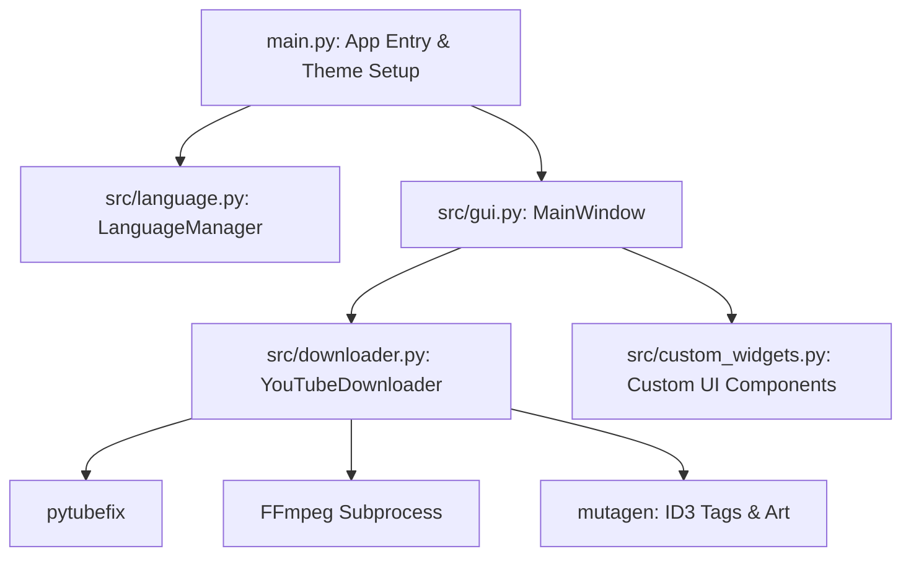

# System Patterns - YTDx

## Architecture Overview
The application follows a modular desktop architecture structured around PyQt6:

## Key Components
1. **`main.py`**:
   - Initializes logging, `LanguageManager`, `QApplication` with Fusion style and palette themes (Dark/Light).
   - Manages restart cycles and window launch.

2. **`src/language.py`**:
   - Manages translation dictionaries loaded from `languages/` (JSON files).
   - Handles language and theme persistence.

3. **`src/gui.py`**:
   - Implements `MainWindow` (tabs: Single Download, Playlist, Settings, About).
   - Uses `QThread` and `QObject` signals/slots for non-blocking asynchronous downloads and UI updates.

4. **`src/downloader.py`**:
   - Handles interaction with YouTube via `pytubefix`.
   - Streams download progress, merges streams using `ffmpeg`, tags audio with `mutagen`.

5. **`src/custom_widgets.py`**:
   - Reusable styled widgets (custom buttons, cards, progress bars).
